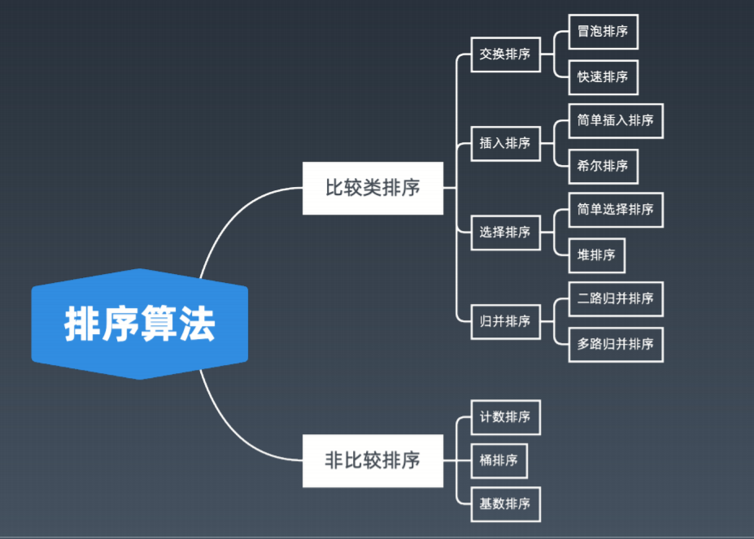
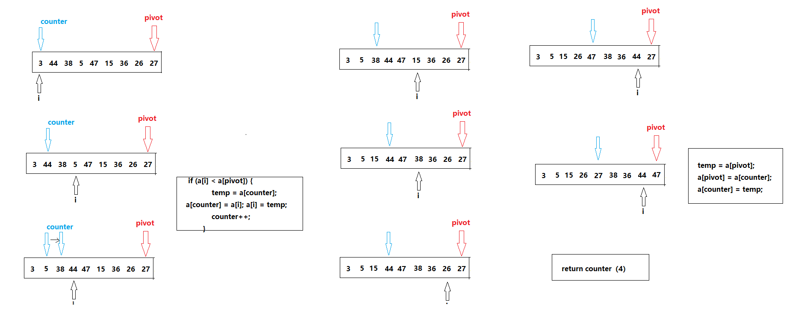

# 排序算法

本文内容整理自好博客https://www.cnblogs.com/onepixel/p/7674659.html 以及公众号五分钟学算法

1.比较类排序：（可以整型、对象、字符型）

通过比较来决定元素间的相对次序，由于其时间复杂度不能突破 **O(nlogn)**，因此也称为**非线性时间比较类排序**。 

2.非比较类排序： （一般针对整型，需要耗费内存空间）

不通过比较来决定元素间的相对次序，它可以突破基于比较排序的时间下界，以线性时间运行，因此也称为**线性时间非比较类排序**。




各排序算法复杂度表格如下：

|  排序方法  | （平均）时间复杂度 | （最坏）时间复杂度 | （最好）时间复杂度 | 空间复杂度 | 稳定性 |
| :--------: | ------------------ | ------------------ | ------------------ | ---------- | ------ |
|  冒泡排序  | O(n^2)             | O(n^2)             | O(n)               | O(1)       | 稳     |
|  插入排序  | O(n^2)             | O(n^2)             | O(n)               | O(1)       | 稳     |
| *选择排序* | O(n^2)             | O(n^2)             | O(n^2)             | O(1)       | 不稳   |
| *希尔排序* | O(n^1.3)           | O(n^2)             | O(n)               | O(1)       | 不稳   |
| *快速排序* | O(nlogn)           | O(n^2)             | O(nlogn)           | O(nlogn)   | 不稳   |
|  归并排序  | O(nlogn)           | O(nlogn)           | O(nlogn)           | O(n)       | 稳定   |
|  *堆排序*  | O(nlogn)           | O(nlogn)           | O(nlogn)           | O(1)       | 不稳   |
|    特殊    |                    |                    |                    |            |        |
|  计数排序  | O(n+k)             | O(n+k)             | O(n+k)             | O(n+k)     | 稳     |
|   桶排序   | O(n+k)             | O(n^2)             | O(n)               | O(n+k)     | 稳     |
|  基数排序  | O(n*k)             | O(n*k)             | O(n*k)             | O(n+k)     | 稳     |

#### 1、冒泡排序（Bubble Sort）

冒泡排序，时间复杂度O(n^2)，空间复杂度O(1)。它重复地走访过要排序的数列，一次比较两个元素，如果它们的顺序错误就把它们交换过来。走访数列的工作是重复地进行直到没有再需要交换，也就是说该数列已经排序完成。

###### 1.1 算法描述

- 两个循环，外循环是大元素下沉的次数，一般是len-1（len是数组的长度）；内循环是每次下沉时元素交换的次数，随着不断的下沉而减少，一般是len-1-i（每一次下沉都会减少一个相对较大的元素）；
- 比较相邻的元素。如果第一个比第二个大，就交换它们两个；
- 对每一对相邻元素作同样的工作，从开始第一对到结尾的最后一对，这样在最后的元素应该会是最大的数；
- 针对所有的元素重复以上的步骤，除了已经下沉好的大元素；

###### 1.2 动图演示


###### 1.3 代码示例

```c
void BubbleSort (int *arr, int len) {
    int i,j,temp;
    for (i = 0; i < len-1; i++) {
        for (j = 0; j < len-i-1; j++) {
            if (arr[j] > arr[j+1]) {
                temp = arr[j];
                arr[j] = arr[j+1];
                arr[j+1] = temp;
            }
        }
    }
}
```

#### 2、插入排序（Insertion Sort）

插入排序，时间复杂度O(n^2)，空间复杂度O(1)。它的工作原理是不断插入元素到有序序列中（默认第一个元素为已排好序的序列），对于未排序元素，在已排序序列中**从后向前扫描**，找到相应位置并插入。

###### 2.1 算法描述

一般来说，插入排序都采用in-place（空间复杂度O(1)）在数组上实现。具体算法描述如下：

- 默认第一个元素已经被排序；
- 取出下一个元素，在已经排序的元素序列中从后向前扫描；
- 如果已排序序列中的当前元素大于新元素，将该元素移到下一位置；
- 重复步骤3，直到找到已排序的元素小于或者等于新元素的位置；
- 将新元素插入到该位置后；
- 重复步骤2~5。

###### 2.2 动图演示


###### 2.3 代码示例

```c
void InsertionSort (int *arr, int len) {
    int preIndex, currentElem;
    int i;
    for (i = 1; i < len; i++) {
        preIndex = i - 1;
        currentElem = arr[i];
        while (preIndex >= 0 && arr[preIndex] > currentElem) {
            arr[preIndex + 1] = arr[preIndex];
            preIndex--;
        }
        arr[preIndex + 1] = currentElem;
    }
}
```

#### 3、选择排序（Selection Sort）

选择排序：时间复杂度O(n^2)，空间复杂度O(1)。 不稳定

工作原理：首先在未排序序列中找到最小（大）元素，存放到排序序列的起始位置，然后，再从剩余未排序元素中继续寻找最小（大）元素，然后放到已排序序列的末尾。以此类推，直到所有元素均排序完毕。 

###### 3.1 算法描述

n个记录的直接选择排序可经过n-1趟直接选择排序得到有序结果。具体算法描述如下：

- 初始状态：无序区为R[1..n]，有序区为空；
- 第i趟排序(i=1,2,3…n-1)开始时，当前有序区和无序区分别为R[1..i-1]和R(i..n）。该趟排序从当前无序区中-选出关键字最小的记录 R[k]，将它与无序区的第1个记录R交换，使R[1..i]和R[i+1..n)分别变为记录个数增加1个的新有序区和记录个数减少1个的新无序区；
- n-1趟结束，数组有序化了。

###### 3.2 动图演示

###### 3.3代码示例

```c
void SelectionSort (int *arr, int len) {
    int minIndex, temp;
    int i, j;
    for (i = 0; i < len -1; i++) {
        minIndex = i;
        for (j = i + 1; j < len; j++) {
            if (arr[j] < arr[minIndex]) {
                minIndex = j;
            }
        }
        temp = arr[i];
        arr[i] = arr[minIndex];
        arr[minIndex] = temp;
    }
}
```

#### 4、希尔排序（Shell Sort）

时间复杂度：O(n^1.3)；空间复杂度：O(1)；不稳定

1959年Shell发明，第一个突破O(n2)的排序算法，是简单插入排序的改进版。它与插入排序的不同之处在于，它会优先比较距离较远的元素。希尔排序又叫**缩小增量排序**。

希尔排序的基本思想是：先将整个待排序的记录序列分割成为**若干子序列**，分别进行直接插入排序，待整个序列中的记录”基本有序“时，再对全体记录进行依次直接插入排序。

###### 4.1 算法描述

先将整个待排序的记录序列分割成为若干子序列分别进行直接插入排序，具体算法描述：

- 选择一个增量序列t1，t2，…，tk，其中ti>tj，tk=1；
- 按增量序列个数k，对序列进行k 趟排序；
- 每趟排序，根据对应的增量ti，将待排序列分割成若干长度为m 的子序列，分别对各子表进行直接插入排序。仅增量因子为1 时，整个序列作为一个表来处理，表长度即为整个序列的长度。

###### 4.2 动图演示


###### 4.3 代码示例

```js
void ShellSort (int *arr, int len) {
  int i, preIndex, currentElem, gap;

  for (gap = len / 2; gap >= 1; gap /= 2) {
    for (i = gap; i < len; i += gap) {
      currentElem = arr[i];
      preIndex = i - gap;
      while (preIndex >= 0 && arr[preIndex] > currentElem)
      {
        arr[preIndex + gap] = arr[preIndex];
        preIndex -= gap;
      }
      arr[preIndex + gap] = currentElem;
    }
  }
}
```

#### 5、快速排序（Quick Sort）

快速排序：时间复杂度：O(nlogn)   空间复杂度：O(nlogn)  	不稳定

基本思想：数组取标杆pivot，将小元素放在pivot左侧，大元素放在右侧；然后依次对左边和右边的子数组进行快速排序，以达到整个序列有序。

###### 5.1 算法描述

快速排序使用分治法的思想，将一个数组分成两个子数组。具体算法描述如下：

- 从数列中挑出一个元素，称为 “标杆”（pivot）；
- 重新排序数列，所有元素比标杆值小的摆放在标杆前面，所有元素比标杆值大的摆在标杆的后面（相同的数可以到任一边）。在这个分区退出之后，该标杆就处于数列的中间位置。这个称为分区（partition）操作；
- 递归地（recursive）把小于标杆值元素的子数列和大于标杆值元素的子数列排序。

###### 5.2 partition演示



###### 5.3代码示例

```C
void quickSort (int *arr, int begin, int end) {
    if (end <= begin) return;//递归出口
    int pivot;
    pivot = partition(arr, begin, end);
    quickSort(arr, begin, pivot - 1);
    quickSort(arr, pivot + 1, end);
}

int partition (int *a, int begin, int end) {
    //pivot 标杆位置，counter 小于pivot的元素的个数
    int pivot = end, counter = begin;
    int i, temp;
    //counter代表第一个大于pivot的位置
    //找到比pivot小的元素就会和counter位置的元素交换
    for (i = begin; i < end; i++) {
        if (a[i] < a[pivot]) {
            temp = a[counter]; a[counter] = a[i]; a[i] = temp;
            counter++;
        }
    }
    //最后pivot和counter位置的元素互换，左侧元素均小于pivot，右侧元素均大于pivot
    temp = a[pivot]; a[pivot] = a[counter]; a[counter] = temp;
    return counter;
}
```

###### 5.4 总结与体会

首先，因为快排使用了递归，其时间复杂度的计算涉及主定理。[https://zh.wikipedia.org/wiki/%E4%B8%BB%E5%AE%9A%E7%90%86](https://zh.wikipedia.org/wiki/主定理)

这里的写法主要理解难点在与partition函数，而partition函数的关键就是变量counter。counter不仅代表小于pivot（这里面默认是子数组的end下标的元素）值的元素个数，还代表指向第一个大于pivot值的元素下标。这样就可以解释if语句块的作用，即发现比pivot值小的元素a[i]时，就与第一个大于pivot的元素a[counter]交换位置。这样counter左侧的元素均比pivot值小。最后找到所有比pivot值小的元素后，就可以让a[counter]和a[pivot]交换位置。从而这次partition的数组左侧元素均小于pivot，右侧元素均大于pivot，返回pivot的下标即可。

#### 6、归并排序（Merge Sort）

归并排序：时间复杂度：O(nlogn)   空间复杂度：O(n)  	稳定。该算法是采用分治法（Divide and Conquer）的一个非常典型的应用。将已有序的子序列合并，得到完全有序的序列；即先使每个子序列有序，再使子序列段间有序。若将两个有序表合并成一个有序表，称为2-路归并。 

###### 6.1 算法描述

- 把长度为n的输入序列分成两个长度为n/2的子序列；
- 对这两个子序列分别采用归并排序；
- 将两个排序好的子序列合并成一个最终的排序序列。

###### 6.2 动图演示


###### 6.3 代码示例

```C
void mergeSort (int *arr, int left, int right) {
    if (right <= left)
        return;
    int mid = (left + right) >> 1; //(left + right)/2

    mergeSort(arr, left, mid);
    mergeSort(arr, mid + 1, right);
    merge(arr, left, mid, right);
}

void merge (int *a, int left, int mid, int right) {
    int temp[right - left + 1];
    int i = left, j = mid + 1, k = 0;
    int p;

    while (i <= mid && j <= right) {
        temp[k++] = a[i] <= a[j] ? a[i++] : a[j++];
    }
    while (i <= mid) temp[k++] = a[i++];
    while (j <= right) temp[k++] = a[j++];

    for (p = 0; p < right - left + 1; p++) {
        a[left + p] = temp[p];
    }
}
```

###### 6.4 总结与体会


#### 7、堆排序（Heap Sort）

堆排序： 平均时间复杂度：O(nlogn)； 空间复杂度：O(1)    不稳

堆排序（Heapsort）是指利用堆这种数据结构所设计的一种排序算法。堆积是一个近似完全二叉树的结构，并同时满足堆积的性质：即子结点的键值或索引总是小于（或者大于）它的父节点。

###### 7.1 算法描述

- 将初始待排序关键字序列(R1,R2….Rn)构建成大顶堆，此堆为初始的无序区；
- 将堆顶元素R[1]与最后一个元素R[n]交换，此时得到新的无序区(R1,R2,……Rn-1)和新的有序区(Rn),且满足R[1,2…n-1]<=R[n]；
- 由于交换后新的堆顶R[1]可能违反堆的性质，因此需要对当前无序区(R1,R2,……Rn-1)调整为新堆，然后再次将R[1]与无序区最后一个元素交换，得到新的无序区(R1,R2….Rn-2)和新的有序区(Rn-1,Rn)。不断重复此过程直到有序区的元素个数为n-1，则整个排序过程完成。

###### 7.2 动图演示


###### 7.3代码示例

```C
void heapify(int array[], int length, int i) {
    int left = 2 * i + 1, right = 2 * i + 2;
    int largest = i;

    if (left < length && array[left] > array[largest]) {
        largest = left;
    }
    if (right < length && array[right] > array[largest]) {
        largest = right;
    }

    if (largest != i) {
        int temp = array[i]; array[i] = array[largest]; array[largest] = temp;
        heapify(array, length, largest);
    }
}

void heapSort(int array[], int length) {
    int i;
    if (length == 0) return;

    for (i = length/2 - 1; i >= 0; i--)
        heapify(array, length, i);

    for (i = length - 1; i >= 0; i--) {
        int temp = array[0]; array[0] = array[i]; array[i] = temp;
        heapify(array, i, 0);
    }
}
```

